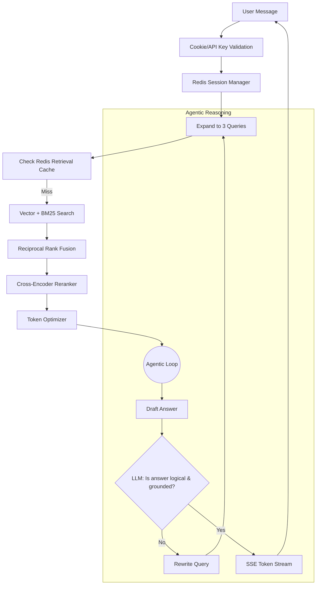

# Agentic Scalable RAG System

A production-grade, highly concurrent, and network-exposed **Agentic RAG** (Retrieval-Augmented Generation) system. This application is built from the ground up for zero-leakage multi-user sessions, employing advanced retrieval techniques (RRF, Cross-Encoder Reranking), a 3-tier cache layer via Redis, and an autonomous Agentic Evaluation Loop ensuring grounded answers.

---

## 🌟 Key Features

1. **Zero-Leakage Multi-User Sessions**: Serves multiple users concurrently without crossing memory streams. Every conversation's context is isolated using HTTP-only cookies and cryptographically secure Session IDs tied to Redis TTL keys.
2. **Session-Scoped Ephemeral Documents**: Users can upload custom documents (`.txt`, `.pdf`) directly through the chat. These are indexed purely in memory (HuggingFace embeddings) for the duration of the 30-minute session and never persist to the global Vector DB, avoiding massive data leakage or pollution.
3. **Autonomous Agentic Loop**: Instead of blindly returning the first LLM generation, the backend runs a strict evaluator LLM loop. If a generated answer hallucinates or contains absurd logical leaps, the agent actively rewrites the search query and retrieves new context to try again.
4. **Hybrid Retrieval + Reciprocal Rank Fusion (RRF)**: Combines keyword search (BM25) and semantic vector search (ChromaDB) to retrieve candidates, smoothly fused together using RRF `(1 / k + rank)`, completely bypassing arbitrary score-scale normalization.
5. **Cross-Encoder Reranking**: Reorders the top RRF candidates using a HuggingFace Cross-Encoder to ensure only hyper-relevant snippets consume the strict token budget.
6. **Multi-Query Expansion**: User queries are automatically expanded into 3 distinct variations by the LLM in the background to ensure high semantic recall.
7. **3-Tier Redis Cache**: Implements global Embedding Caches, TTL-based Retrieval Caches, and Session-Scoped Response Caches.

---

## 🏗️ Architecture & Data Flow



---

## 🚀 Setup & Installation

### 1. Prerequisites
- **Python 3.11+**
- **Docker** (For the Redis backend)
- **uv** (The blazing fast Python package manager)
- **LM Studio** local instance running `llama-3.2-3b-instruct` or any OpenAI compatible API.

### 2. Install Dependencies
This project uses `uv` for dependency management. To install all requirements cleanly:
```bash
uv sync 
# Alternatively, via pip: pip install -r requirements.txt
```

### 3. Environment Configuration
The project uses a `.env` file to handle configuration so hardcoded variables are kept out of source code.
Copy `.env.example` to `.env` and configure it:
```bash
cp .env.example .env
```
Inside `.env`, verify your connection strings:
```bash
LLM_BASE_URL="http://localhost:1234/v1"
LLM_MODEL_NAME="llama-3.2-3b-instruct"
REDIS_URL="redis://localhost:6379/0"
API_KEY="your_admin_api_key"
CORS_ORIGINS='["http://localhost:3000", "http://127.0.0.1:3000"]'
```

### 4. LM Studio Configuration
- Start the Local Server in LM Studio (default: port `1234`).
- Ensure CORS is enabled globally in the LM Studio server settings.

---

## 🏃 Running the Application

### 1. Start Redis
```bash
docker-compose up -d
```

### 2. Start the FastAPI Backend
To access the server over your local network (e.g., from your phone or another laptop), bind Uvicorn to `0.0.0.0`:
```bash
uv run uvicorn app.main:app --host 0.0.0.0 --port 8000 --reload
```
*Note: On your first start, HuggingFace will download the BGE embedding and reranking models locally.*

### 3. Access the UI
In your browser, navigate to:
```text
http://localhost:8000/
# Or to access via network devices: http://<YOUR_LOCAL_IP>:8000/
```

---

## 🧠 How the Agentic Loop Works

The system implements a self-healing RAG loop to prevent hallucination:
1. **Query & Generate**: The user's query generates a context-aware answer from the primary LLM.
2. **Evaluate**: A secondary, hidden evaluation prompt forces the LLM to grade its own answer strictly against the retrieved textual context. It explicitly looks for temporal hallucinations (e.g., date ranges going background) and logic anomalies.
3. **Rewrite & Retry**: If the evaluator grades the generation as `BAD`, an adversarial rewrite module reconstructs the user's original query to improve retrieval, fetching entirely new documents from the database, and trying again.
4. **Natural Streaming**: Once passed, the final validated answer is streamed via Server-Sent Events (SSE) directly to the user's browser UI.

---

## 🛡️ Simultaneous Users Without Data Leaks

### Session Isolation
User states are isolated exclusively using strict `HttpOnly`, `SameSite=Strict` cookies. The frontend client has zero awareness of its Session ID—closing severe CSRF vectors. When a JWT or API Key is verified, the UUID session token unlocks one partitioned namespace in Redis where chat memory is stored. 

### Ephemeral Uploads
Traditional RAG systems store all user-uploaded documents in a global Vector DB, risking Alice querying Bob's confidential documents by accident. 
In this Application:
- Chat attachments are chunked, tokenized, and embedded instantaneously into **RAM-only matrices**.
- Cosine similarity is computed via `numpy` dynamically during the session.
- Once the Redis TTL expires (30 mins of inactivity) or the chat is cleared, the memory is deleted forever.
- Bob physically cannot query Alice's documents because they are never persisted to ChromaDB.
